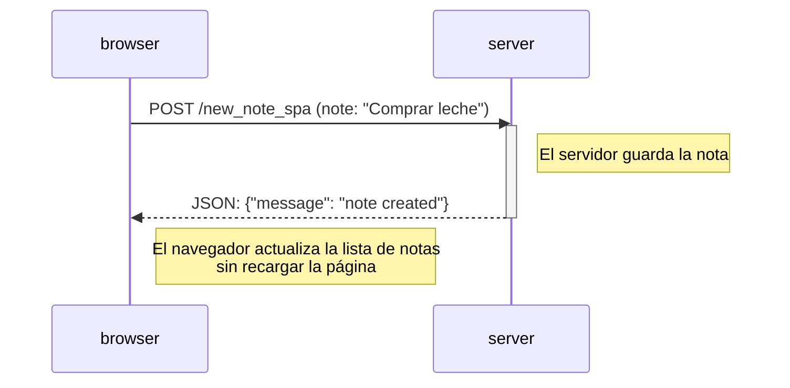

```mermaid
sequenceDiagram
    participant browser
    participant server

    browser->>server: POST /new_note_spa (note: "Comprar leche")
    activate server
    Note right of server: El servidor guarda la nota
    server-->>browser: JSON: {"message": "note created"}
    deactivate server

    Note right of browser: El navegador actualiza la lista de notas<br/>sin recargar la página
```